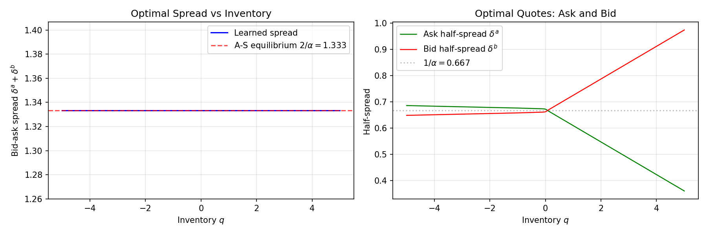
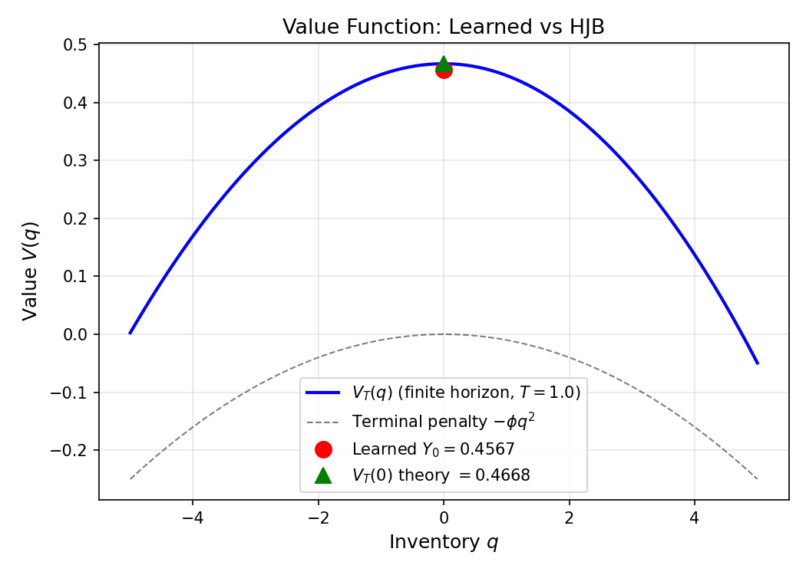
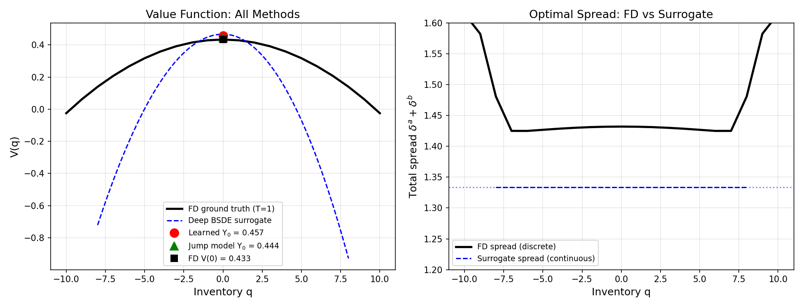
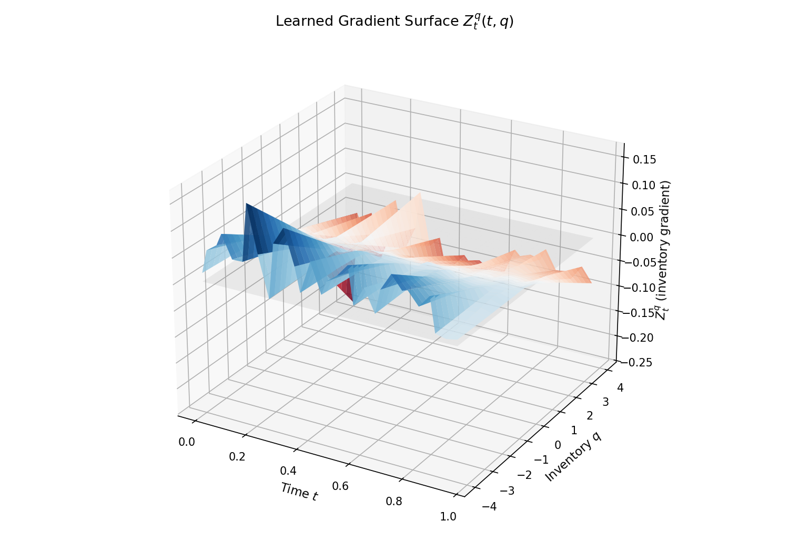
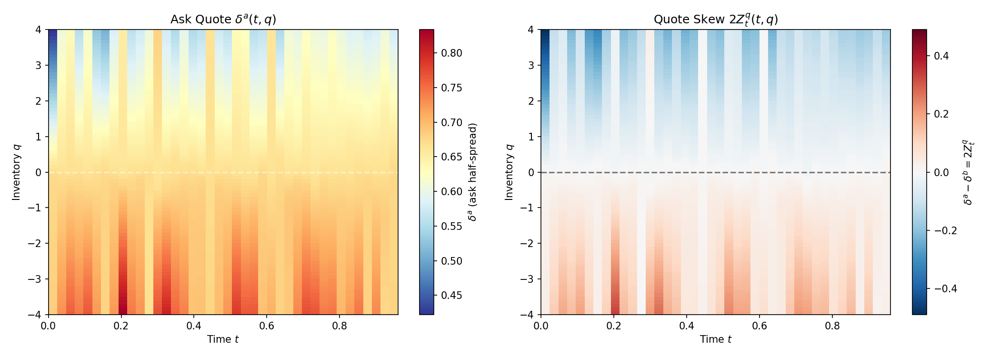
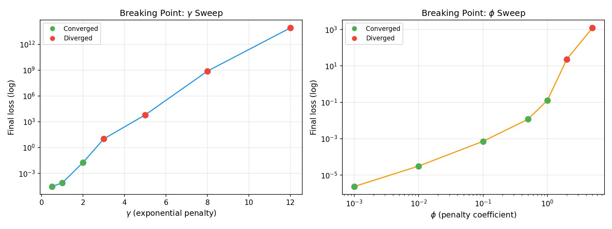
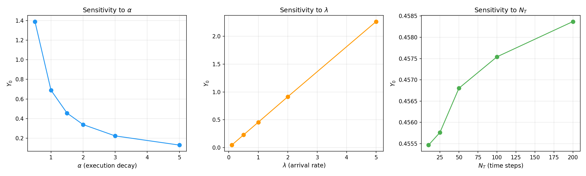
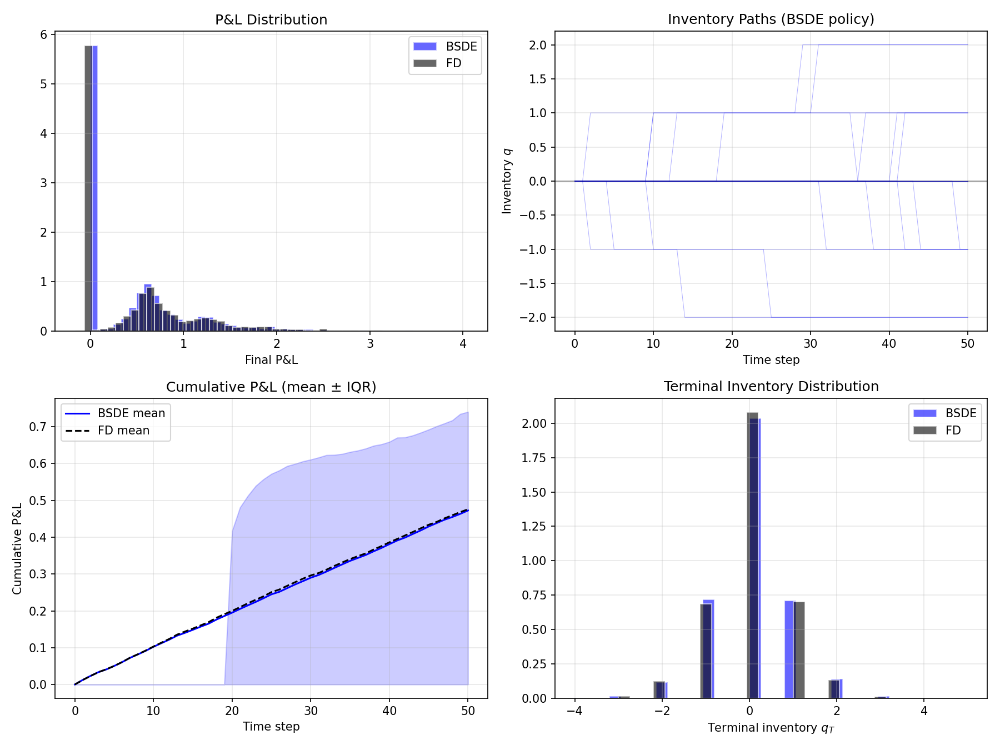

# A Deep Jump-BSDE Solver for Optimal Market-Making in Limit Order Books

**[Read the paper (PDF)](paper.pdf)**

A PyTorch implementation of two deep BSDE solvers for optimal market-making in the Cont-Xiong (2024) dealer market model: a **jump-aware formulation** (FBSDEJ) preserving the discrete Poisson inventory structure, and a **diffusion surrogate** for comparison. Validated against a matched finite-horizon finite-difference baseline with cross-dynamics policy evaluation.

The solver extends the Deep BSDE framework (Han, Jentzen, E, 2018) and the McKean-Vlasov fictitious play approach (Han, Hu, Long, 2022) to forward-backward SDEs with Poisson jumps. The neural network outputs the Brownian gradient Z_t and discrete jump value increments U_t^+/- at each time step; optimal bid-ask quotes are recovered from the HJB first-order conditions.

## Key Results

### Method Comparison (Table 2)

| Method | Y_0 or V(0) | Loss | Spread | Error vs FD |
|--------|-------------|------|--------|-------------|
| **FD finite-horizon** (matched T, g) | **0.457** | exact | 1.370 | -- |
| FD stationary (T = inf) | 4.555 | exact | 1.432 | -- |
| Deep BSDE surrogate (5 seeds) | 0.457 +/- 0.000 | 3.4e-05 | 1.333 | <0.1% |
| Deep BSDE jump (5 seeds) | 0.446 +/- 0.002 | 2.6e-05 | discrete | 2.4% |

### Forward Policy Simulation (Table 3)

Cross-dynamics evaluation: surrogate policy trained under diffusion, deployed under true Poisson execution (5000 paths, common random numbers for price).

| Metric | BSDE Policy | FD Policy |
|--------|-------------|-----------|
| Mean final P&L | 0.466 | 0.469 |
| Std final P&L | 0.571 | 0.580 |
| Sharpe ratio | 0.82 | 0.81 |
| Mean \|q_T\| | 0.54 | 0.53 |
| Mean spread | 1.333 | 1.368 |

The surrogate-trained policy captures 99.3% of FD-optimal P&L.

### Stress Tests Under Non-Linear Penalties (Table 4)

Deep BSDE surrogate (5 seeds, 3000 iterations, phi = 0.01) vs FD stationary reference.

| Penalty | Deep BSDE Y_0 | max \|Z_t\| | FD V(0) | FD Spread |
|---------|---------------|-------------|---------|-----------|
| Quadratic | 0.457 +/- 0.000 | 0.097 +/- 0.018 | 4.555 | 1.432 |
| Cubic | 0.452 +/- 0.000 | 0.145 +/- 0.020 | 4.410 | 1.475 |
| Exponential | 0.448 +/- 0.000 | 0.131 +/- 0.023 | 4.384 | 1.483 |

### Breaking Point (Table 5)

Parameter sweeps (3000 iterations, single seed). The solver diverges at gamma ~ 3 (exponential penalty) and phi ~ 2 (quadratic penalty).

| Parameter | Value | Y_0 | max \|Z_t\| | Status |
|-----------|-------|-----|-------------|--------|
| gamma | 0.5 | 0.460 | 0.05 | Stable |
| gamma | 1.0 | 0.448 | 0.12 | Stable |
| gamma | 2.0 | 0.349 | 2.22 | Marginal |
| gamma | **3.0** | -3.363 | 258 | **Diverged** |
| phi | 0.01 | 0.456 | 0.09 | Stable |
| phi | 0.1 | 0.376 | 0.61 | Stable |
| phi | 0.5 | 0.185 | 1.48 | Stable |
| phi | 1.0 | 0.245 | 1.39 | Marginal |
| phi | **2.0** | -6.051 | 17.7 | **Diverged** |

### Horizon Sensitivity (Table 6)

Matched FD vs Deep BSDE surrogate (1000 iterations).

| T | FD V(0,0) | BSDE Y_0 | FD Spread | Error |
|---|-----------|----------|-----------|-------|
| 0.5 | 0.235 | 0.236 | 1.362 | 0.3% |
| 1.0 | 0.457 | 0.457 | 1.370 | 0.1% |
| 2.0 | 0.866 | 0.864 | 1.383 | 0.2% |
| 5.0 | 1.852 | 1.172 | 1.410 | 36.7% |

Accurate for T <= 2; fails at T = 5 due to Euler discretisation error accumulating over N_T = 50 steps.

### Mean-Field Ablation (Section 7.7)

Comparing Type 1 (no coupling) vs Type 3 (moment-proxy fictitious play) across 5 seeds: Y_0 = 0.4566 +/- 0.0002 vs 0.4568 +/- 0.0001. The moment-based mean-field proxy has no measurable effect at phi = 0.01. Distribution-dependent coupling is needed to make the mean-field interaction substantive.

## Core Finding

Accurate value approximation does not guarantee accurate control recovery. The diffusion surrogate achieves <0.1% value error but its total spread (2/alpha = 1.333) is structurally constant -- a property fixed by the control parameterisation, not learned. The FD spread (1.370) is 2.7% wider. Despite this structural bias, the surrogate-trained policy deployed under true Poisson execution captures 99.3% of FD-optimal P&L, showing that structurally biased controls can remain economically robust in low inventory-penalty regimes.

This robustness should not be expected to hold under stronger inventory penalties or models with adverse selection.

## Scope and Limitations

- Experiments are at d = 2 (price + inventory) after dimensional reduction. The purpose is validation and diagnosis, not computational advantage over finite differences.
- The mean-field coupling uses a moment-based proxy, not full distribution dependence.
- The diffusion surrogate solves a *different control problem* from the original game.
- The price process is economically inert (driftless, execution rates independent of S), reducing the value function to one effective dimension in q.

## Figures

### Training and Quoting
<p float="left">


</p>

### Value Function and Ground Truth Comparison
<p float="left">


</p>

### Gradient Surface and Quote Skew
<p float="left">


</p>

### Breaking Points and Sensitivity
<p float="left">


</p>

### Policy Simulation


## Installation

```bash
git clone https://github.com/cgarryZA/DeepBSDE-LOB.git
cd DeepBSDE-LOB
pip install torch numpy scipy matplotlib
```

For GPU support:
```bash
pip install torch --index-url https://download.pytorch.org/whl/cu124
```

## Quick Start

**Train the continuous LOB solver:**
```bash
python main.py --config configs/lob_d2.json --exp_name demo --log_dir ./logs --device auto
```

**Train the jump-diffusion solver:**
```bash
python main.py --config configs/lob_d2_jump.json --exp_name jump_demo --log_dir ./logs --device auto
```

**Generate plots:**
```bash
python scripts/plot_lob.py --config configs/lob_d2.json \
    --result logs/demo_result.txt \
    --weights logs/demo_model.pt \
    --out_dir plots
```

**Run the full experiment suite:**
```bash
python scripts/run_all_experiments.py --device cuda        # full (5 seeds, ~12 hours)
python scripts/run_all_experiments.py --quick --device cuda  # quick (2 seeds, ~1.5 hours)
```

**Find the solver's breaking point:**
```bash
python scripts/find_breaking_point.py --param gamma --lo 0.1 --hi 5.0 --penalty exponential
```

**Forward policy simulation:**
```bash
python scripts/simulate_policy.py --weights logs/demo_model.pt
```

## Repository Structure

```
DeepBSDE-LOB/
├── paper.pdf                        # Preprint (14 pages)
├── main.py                          # Training entry point
├── solver.py                        # All model + solver classes
├── config.py                        # Configuration dataclasses
├── registry.py                      # Equation registration
├── equations/
│   ├── base.py                      # Abstract base class
│   ├── sinebm.py                    # Sine-BM benchmark (Han-Hu-Long 2022)
│   ├── flocking.py                  # Cucker-Smale MFG benchmark
│   ├── contxiong_lob.py             # Diffusion surrogate (Section 4)
│   └── contxiong_lob_jump.py        # Jump-BSDE solver (Section 3)
├── configs/                         # JSON experiment configs
├── scripts/
│   ├── plot_lob.py                  # Main visualization suite
│   ├── plot_experiments.py          # Experiment result plots
│   ├── plot_grid_comparison.py      # FD vs BSDE full-grid comparison
│   ├── simulate_policy.py           # Forward P&L simulation
│   ├── find_breaking_point.py       # Binary search for instability
│   ├── finite_difference_baseline.py        # Stationary FD solver
│   ├── finite_difference_finite_horizon.py  # Matched finite-horizon FD
│   ├── run_experiments.py           # Basic experiment runner
│   └── run_all_experiments.py       # Full experiment suite
├── plots/                           # Generated figures
└── results/                         # Experiment result JSON files
```

## Configuration

Key parameters in `configs/lob_d2.json`:

| Parameter | Default | Description |
|-----------|---------|-------------|
| `sigma_s` | 0.3 | Mid-price volatility |
| `lambda_a`, `lambda_b` | 1.0 | Order arrival rates |
| `alpha` | 1.5 | Execution probability decay |
| `phi` | 0.01 | Inventory penalty coefficient |
| `discount_rate` | 0.1 | Discount rate r |
| `penalty_type` | `"quadratic"` | `"quadratic"`, `"cubic"`, or `"exponential"` |
| `num_time_interval` | 50 | Euler-Maruyama time steps |

## Citation

```bibtex
@misc{garry2026deepbsdelob,
  author       = {Christian Garry},
  title        = {A Deep Jump-{BSDE} Solver for Optimal Market-Making
                  in Limit Order Books},
  year         = {2026},
  howpublished = {\url{https://github.com/cgarryZA/DeepBSDE-LOB}},
}
```

## References

- Cont, R. & Xiong, W. (2024). Dynamics of market making algorithms in dealer markets. *Mathematical Finance*, 34:467-521.
- Han, J., Jentzen, A. & E, W. (2018). Solving high-dimensional PDEs using deep learning. *PNAS*, 115(34):8505-8510.
- Han, J., Hu, R. & Long, J. (2022). Learning high-dimensional McKean-Vlasov FBSDEs. *SIAM J. Numer. Anal.*, 60(4):2208-2232.
- Avellaneda, M. & Stoikov, S. (2008). High-frequency trading in a limit order book. *Quantitative Finance*, 8(3):217-224.
- Andersson, K. et al. (2023). A deep solver for BSDEs with jumps. *arXiv:2211.04349*.

## License

MIT
